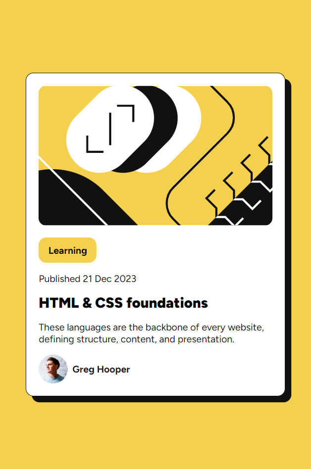
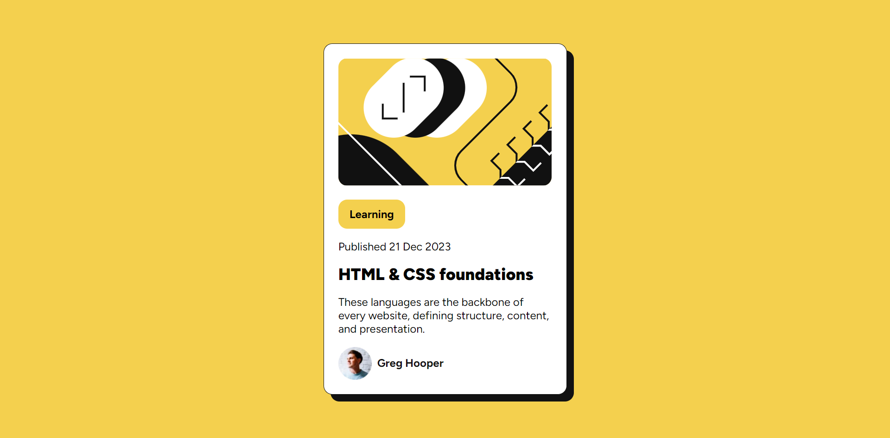

# Frontend Mentor - Blog preview card solution

This is a solution to the [Blog preview card challenge on Frontend Mentor](https://www.frontendmentor.io/challenges/blog-preview-card-ckPaj01IcS).

## Overview

### The challenge

- Implement a Blog preview card

### Screenshot

# Mobile Preview Screenshot

# Large Screen Preview Screenshot

### Links

- Live Site URL: https://blog-preview-card-karthik.netlify.app/

## My process

### Built with

- Semantic HTML5 markup
- CSS custom properties
- Flex box
- Mobile-first workflow

## Author

- Implemented by Karthik Yerra.
